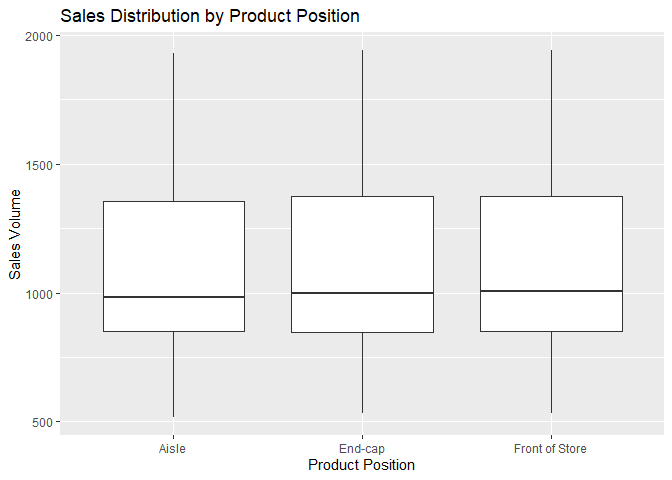
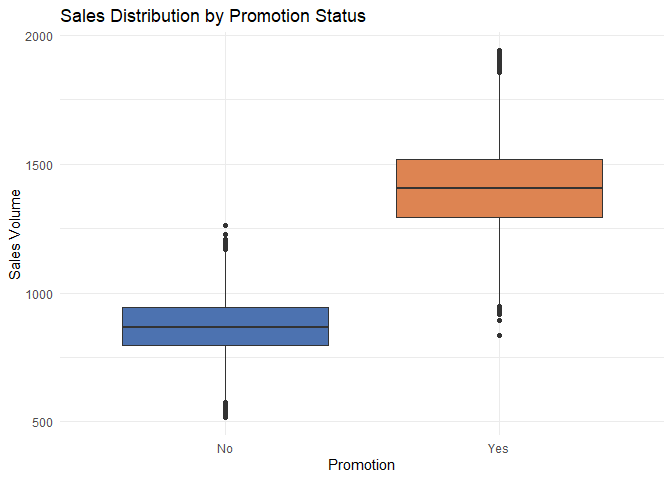
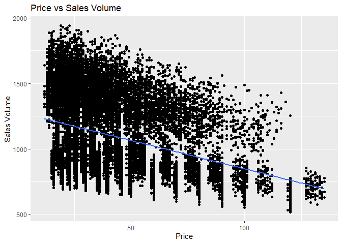
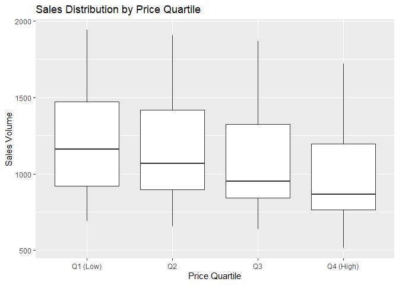
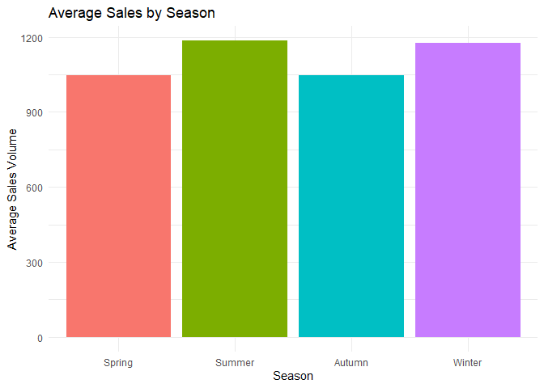
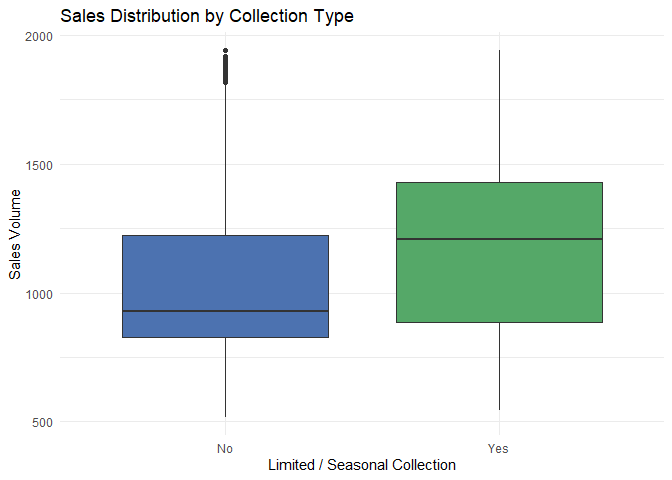
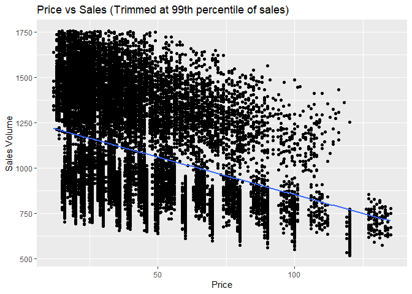

Final Project
================
Ivy Zi Yi Chu
2025-12-14

# 1 Introduction

Fast-fashion retailers (e.g., Zara) rely on **product positioning**,
**pricing**, **promotions**, and **seasonal timing** to drive sales.
This project uses a public Kaggle dataset to explore which factors are
most associated with sales volume.

**Why this is interesting:** Retail decisions (where to place items,
whether to promote, and how to price) directly affect demand and
inventory planning.

**Roadmap:** We answer five questions:

1.  Are some product positions associated with higher sales?

2.  Do promoted items sell more than non-promoted items?

3.  What is the relationship between price and sales?

4.  Are there seasonal patterns in sales?

5.  Do items belonging to limited or seasonal collections differ in
    sales from regular items?

We also include basic “scepticism checks” (outlier trimming +
alternative summaries) to avoid over-interpreting noisy patterns.

# 2 Data

## 2.1 Data source and structure

The dataset is the Kaggle dataset “Zara Sales for EDA”. It contains
product-level information (e.g., position, category, section, season,
promotion, price) and the outcome variable Sales Volume.

Key variables used in this report:

- Product Position: where the product is placed (Aisle, End-cap, Front
  of Store)

- Promotion: promotion status (Yes/No)

- Price: item price

- Season: season label (Spring/Autumn/Summer/Winter)

- Seasonal flag: whether the item belongs to a limited or seasonal
  collection (Yes/No)

- Sales Volume: outcome variable (sales)

## 2.2 Load data

``` r
df <- readr::read_delim("Zara_sales_EDA.csv", delim = ";", show_col_types = FALSE)
glimpse(df)
```

    ## Rows: 20,252
    ## Columns: 17
    ## $ `Product ID`       <dbl> 185102, 188771, 180176, 112917, 192936, 117590, 189…
    ## $ `Product Position` <chr> "Aisle", "Aisle", "End-cap", "Aisle", "End-cap", "E…
    ## $ Promotion          <chr> "Yes", "Yes", "Yes", "Yes", "Yes", "Yes", "No", "Ye…
    ## $ `Product Category` <chr> "clothing", "clothing", "clothing", "clothing", "cl…
    ## $ Seasonal           <chr> "Yes", "No", "Yes", "No", "Yes", "Yes", "No", "Yes"…
    ## $ `Sales Volume`     <dbl> 1243, 1429, 1168, 1348, 1602, 1282, 688, 1711, 857,…
    ## $ brand              <chr> "Zara", "Zara", "Zara", "Zara", "Zara", "Zara", "Za…
    ## $ url                <chr> "https://www.zara.com/us/en/basic-puffer-jacket-p06…
    ## $ name               <chr> "BASIC PUFFER JACKET", "TUXEDO JACKET", "SLIM FIT S…
    ## $ description        <chr> "Puffer jacket made of tear-resistant ripstop fabri…
    ## $ price              <dbl> 78.99, 14.99, 71.95, 30.99, 22.99, 25.95, 87.99, 24…
    ## $ currency           <chr> "USD", "USD", "USD", "USD", "USD", "USD", "USD", "U…
    ## $ terms              <chr> "jackets", "jackets", "jackets", "jackets", "jacket…
    ## $ section            <chr> "MAN", "MAN", "WOMAN", "MAN", "WOMAN", "WOMAN", "MA…
    ## $ season             <chr> "Winter", "Autumn", "Autumn", "Spring", "Winter", "…
    ## $ material           <chr> "Polyester", "Cotton", "Polyester", "Polyester", "W…
    ## $ origin             <chr> "Brazil", "Turkey", "Morocco", "China", "China", "T…

## 2.3 Cleaning

``` r
zara <- df |>
select(
  product_position = `Product Position`,
  promotion = Promotion,
  product_category = `Product Category`,
  section = section,
  seasonal_flag = Seasonal,
  season = season,
  price = price,
  sales = `Sales Volume`
) |>
mutate(
  product_position = as.factor(product_position),
  promotion = as.factor(promotion),
  product_category = as.factor(product_category),
  section = as.factor(section),
  seasonal_flag = as.factor(seasonal_flag),
  season = as.character(season),
  season = factor(season, levels = c("Spring", "Summer", "Autumn", "Winter")),
  price = as.numeric(price),
  sales = as.numeric(sales)
) |>
distinct() |>
drop_na(product_position, promotion, season, seasonal_flag, price, sales)

glimpse(zara)
```

    ## Rows: 19,978
    ## Columns: 8
    ## $ product_position <fct> Aisle, Aisle, End-cap, Aisle, End-cap, End-cap, Front…
    ## $ promotion        <fct> Yes, Yes, Yes, Yes, Yes, Yes, No, Yes, No, No, Yes, Y…
    ## $ product_category <fct> clothing, clothing, clothing, clothing, clothing, clo…
    ## $ section          <fct> MAN, MAN, WOMAN, MAN, WOMAN, WOMAN, MAN, WOMAN, WOMAN…
    ## $ seasonal_flag    <fct> Yes, No, Yes, No, Yes, Yes, No, Yes, Yes, No, Yes, No…
    ## $ season           <fct> Winter, Autumn, Autumn, Spring, Winter, Autumn, Winte…
    ## $ price            <dbl> 78.99, 14.99, 71.95, 30.99, 22.99, 25.95, 87.99, 24.0…
    ## $ sales            <dbl> 1243, 1429, 1168, 1348, 1602, 1282, 688, 1711, 857, 7…

``` r
summary(zara)
```

    ##        product_position promotion   product_category  section     
    ##  Aisle         :7686    No :11565   clothing:19978   MAN  : 6924  
    ##  End-cap       :6693    Yes: 8413                    WOMAN:13054  
    ##  Front of Store:5599                                              
    ##                                                                   
    ##                                                                   
    ##                                                                   
    ##  seasonal_flag    season         price            sales     
    ##  No : 9940     Spring:4478   Min.   : 12.00   Min.   : 518  
    ##  Yes:10038     Summer:2890   1st Qu.: 23.95   1st Qu.: 850  
    ##                Autumn:7485   Median : 35.95   Median : 995  
    ##                Winter:5125   Mean   : 42.02   Mean   :1100  
    ##                              3rd Qu.: 53.95   3rd Qu.:1367  
    ##                              Max.   :134.99   Max.   :1940

# 3 Results (Main Findings)

## 3.1 Question 1: Product position and sales

**Question:** Do different product positions show different average
sales?

First, we compare group summaries:

``` r
pos_tbl <- zara |>
group_by(product_position) |>
summarise(
n = n(),
avg_sales = mean(sales),
med_sales = median(sales),
.groups = "drop"
)

kable(pos_tbl, caption = "Sales summary by product position")
```

| product_position |    n | avg_sales | med_sales |
|:-----------------|-----:|----------:|----------:|
| Aisle            | 7686 |  1093.368 |       984 |
| End-cap          | 6693 |  1102.681 |       998 |
| Front of Store   | 5599 |  1105.421 |      1004 |

Sales summary by product position

Then, we compare the distribution of sales:

``` r
ggplot(zara, aes(x = product_position, y = sales)) +
  geom_boxplot() +
  labs(
  title = "Sales Distribution by Product Position",
  x = "Product Position",
  y = "Sales Volume"
)
```

<!-- -->

**Interpretation:** In real retail settings, we may expect better
positions to increase sales. However, in this dataset, both the summary
statistics and distributions are very similar across positions. This
suggests that product position alone is not a strong driver of sales
here, or that the effect may be confounded by other factors (e.g.,
promotions or product selection) or managed by retail strategy.

## 3.2 Question 2: Promotion and sales

**Question:** Do promoted products sell more?

``` r
promo_tbl <- zara |>
  group_by(promotion) |>
  summarise(
  n = n(),
  avg_sales = mean(sales),
  med_sales = median(sales),
  .groups = "drop"
  )

kable(promo_tbl, caption = "Sales summary by promotion status")
```

| promotion |     n | avg_sales | med_sales |
|:----------|------:|----------:|----------:|
| No        | 11565 |  872.5493 |       868 |
| Yes       |  8413 | 1412.3492 |      1406 |

Sales summary by promotion status

``` r
ggplot(zara, aes(x = promotion, y = sales, fill = promotion)) +
  geom_boxplot() +
  scale_fill_manual(
    values = c("No" = "#4C72B0", "Yes" = "#DD8452")
  ) +
  labs(
    title = "Sales Distribution by Promotion Status",
    x = "Promotion",
    y = "Sales Volume"
  ) +
  theme_minimal() +
  theme(legend.position = "none")
```

<!-- -->

**Interpretation:**

Promoted products have a clearly higher median sales volume than
non-promoted products, and their sales distribution extends to much
higher values. This suggests that promotion is strongly associated with
increased sales, although the relationship should be interpreted as
associative rather than causal.

## 3.3 Question 3: Price and sales

**Question:** How is price related to sales?

``` r
ggplot(zara, aes(x = price, y = sales)) +
  geom_point() +
  geom_smooth(method = "lm", se = FALSE) +
  labs(
    title = "Price vs Sales Volume",
    x = "Price",
    y = "Sales Volume"
    )
```

    ## `geom_smooth()` using formula = 'y ~ x'

<!-- -->

To make patterns easier to interpret, we also compare sales across price
quartiles:

``` r
zara_q <- zara |>
  mutate(price_quartile = ntile(price, 4) |>
  factor(labels = c("Q1 (Low)", "Q2", "Q3", "Q4 (High)")))

ggplot(zara_q, aes(x = price_quartile, y = sales)) +
  geom_boxplot() +
  labs(
    title = "Sales Distribution by Price Quartile",
    x = "Price Quartile",
    y = "Sales Volume"
    )
```

<!-- -->

**Interpretation:**

The scatter plot shows a clear negative relationship between price and
sales volume: as price increases, sales generally decrease. This trend
is further confirmed by the price quartile boxplots, where lower-priced
items (Q1 and Q2) have higher median sales than higher-priced items (Q3
and Q4). While there is substantial variability within each price range,
the overall pattern suggests that price is an important factor
associated with sales volume.

## 3.4 Question 4: Seasonality

**Question:** Do sales differ by season?

``` r
zara |>
  group_by(season) |>
  summarise(avg_sales = mean(sales), .groups = "drop") |>
  ggplot(aes(x = season, y = avg_sales, fill = season)) +
  geom_col() +
  labs(
    title = "Average Sales by Season",
    x = "Season",
    y = "Average Sales Volume"
  ) +
  theme_minimal() +
  theme(legend.position = "none")
```

<!-- -->

**Interpretation:**

Average sales vary moderately across seasons. Summer and winter show
higher average sales than spring and autumn, suggesting increased demand
during peak shopping periods. However, the differences are not large,
indicating that seasonality plays a secondary role compared to promotion
and price.

## 3.5 Question 5: Limited / seasonal collection items

**Question:** Do items belonging to limited or seasonal collections
differ in sales from regular items?

``` r
ggplot(zara, aes(x = seasonal_flag, y = sales, fill = seasonal_flag)) +
  geom_boxplot() +
  scale_fill_manual(values = c("No" = "#4C72B0", "Yes" = "#55A868")) +
  labs(
    title = "Sales Distribution by Collection Type",
    x = "Limited / Seasonal Collection",
    y = "Sales Volume"
  ) +
  theme_minimal() +
  theme(legend.position = "none")
```

<!-- -->

**Interpretation:**

Items that belong to limited or seasonal collections tend to have
slightly higher sales than regular items, although the difference is
modest. This suggests that being part of a special or seasonal
collection may provide a small sales advantage, but the effect is weaker
than that of promotion or price.

# 4 Scepticism: Simple robustness check (trim extreme sales)

EDA results can be distorted by extreme values. We trim the top 1% of
sales and re-check one key relationship (price vs sales).

``` r
cutoff <- quantile(zara$sales, 0.99, na.rm = TRUE)
zara_trim <- zara |> filter(sales <= cutoff)

ggplot(zara_trim, aes(x = price, y = sales)) +
  geom_point() +
  geom_smooth(method = "lm", se = FALSE) +
  labs(
    title = "Price vs Sales (Trimmed at 99th percentile of sales)",
    x = "Price",
    y = "Sales Volume"
    )
```

    ## `geom_smooth()` using formula = 'y ~ x'

<!-- -->

After trimming the top 1% of sales values, the negative association
between price and sales remains. This suggests the price–sales
relationship is not driven by a small number of extreme outliers.

# 5 Limitations

- This dataset does not include store location, customer demographics,
  or detailed discount amounts.

- Promotion is recorded as a simple indicator (Yes/No), so causal
  effects cannot be estimated.

- This report focuses on association patterns rather than causal claims.

# 6 Conclusions

- **Product position**: Sales distributions are very similar across
  positions; position alone is not a strong driver in this dataset.

- **Promotion**: Promoted products show substantially higher sales
  volumes than non-promoted products.

- **Price**: Price is negatively associated with sales volume;
  lower-priced items consistently exhibit higher sales than
  higher-priced items, as confirmed by both scatter plots and price
  quartile comparisons.

- **Seasonality**: Average sales are moderately higher in summer and
  winter than in spring and autumn, and items belonging to limited or
  seasonal collections show a small sales advantage over regular items.

Future work: Add richer promotion information (discount percentage), and
build a simple predictive model using position + promotion + price +
season to estimate sales volume and evaluate interactions more formally.
